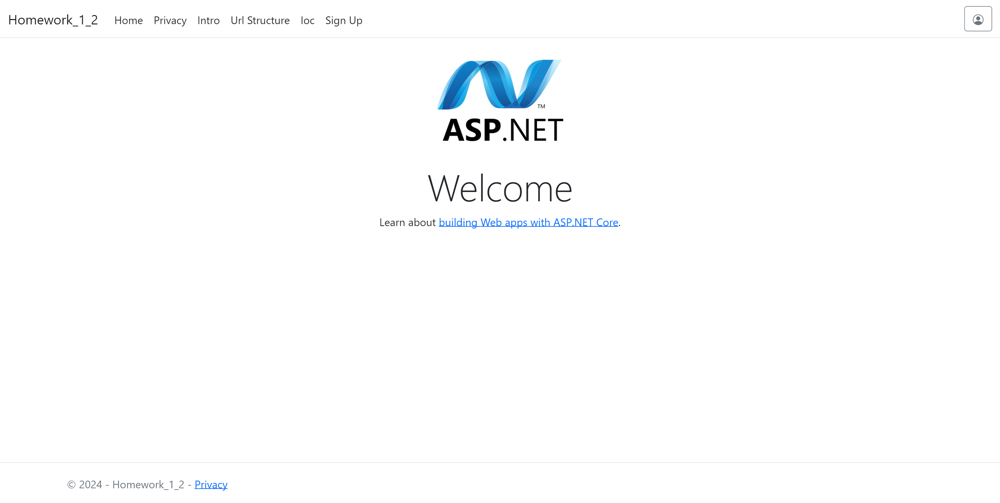
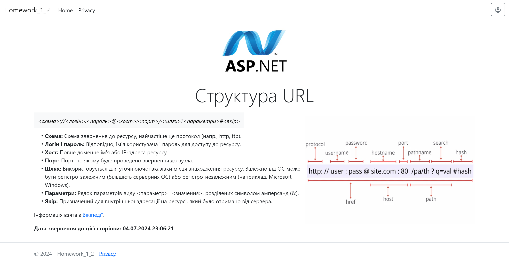
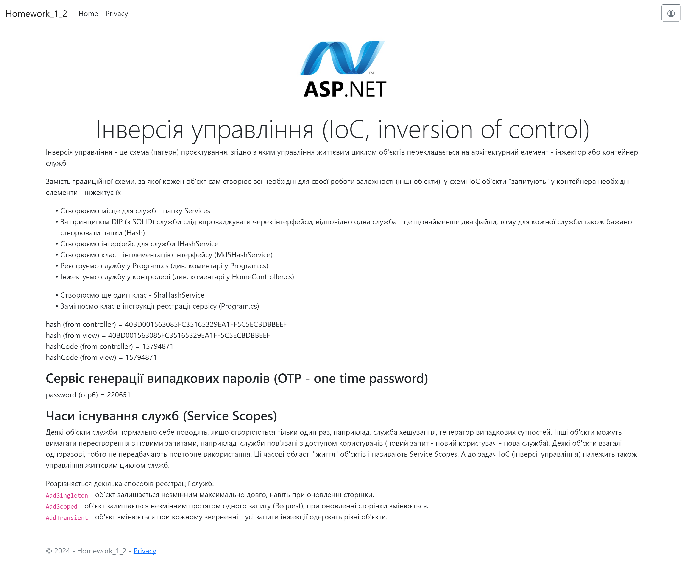
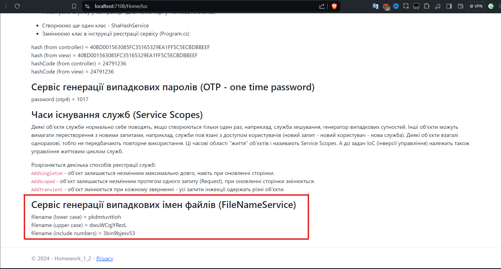

# ASP Homework 1-2

- [Welcome Page](#welcome-page)
- [Url Structure](#url-structure)
- [One Time Password](#one-time-password)
  - [OTP6](#otp6)
  - [OTP4](#otp4)

# Welcome page

[Commit Link](https://github.com/SlavikArt/ASP_HW_01/commit/37aa475fa99241ff5c85d80eeb2e1f81cdb98b90)

    

# Url Structure

[Commit Link](https://github.com/SlavikArt/ASP_HW_01/commit/37aa475fa99241ff5c85d80eeb2e1f81cdb98b90)

    

# One Time Password

[Commit Link](https://github.com/SlavikArt/ASP_HW_01/commit/37aa475fa99241ff5c85d80eeb2e1f81cdb98b90)

## OTP6

    

## OTP4

    

# Filename Generation Service

[Commit Link](https://github.com/SlavikArt/ASP_HW_01/commit/93ba57d4e555bea1f9ae745e6aba9662936c100e)

    

